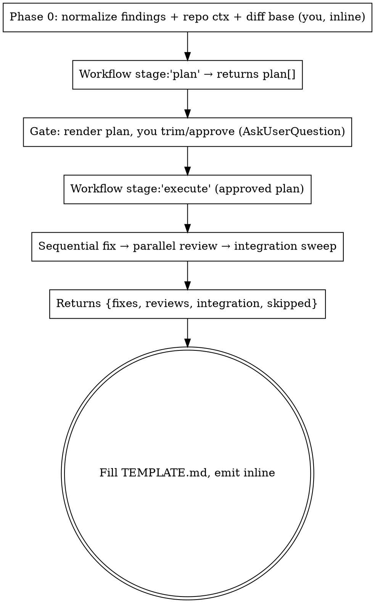

# Greatfix

The remediation arm of `greatreview`. Where greatreview *finds and validates* weaknesses (read-only), greatfix *fixes them and verifies the fix* — driven by a static bundled workflow (`greatfix.workflow.js`) run by the `Workflow` tool. It takes a validated weakness map (ideally greatreview's structured output, but any findings list works), turns it into an action plan you approve, fixes each item **one at a time in the working tree** with reproduce-first discipline, and then fans out adversarial reviewers to check every fix actually resolves its finding and follows the codebase's conventions.

**Mutating but conservative.** It edits files **in the branch you are already on** — it does not create a branch or a worktree unless you explicitly ask for one — and runs the project's test/typecheck/lint. It **never commits, pushes, weakens a test, or leaves a red suite** — if a fix can't go green cleanly it reverts that fix and reports it. You review the final diff and commit. Renders with this skill's `TEMPLATE.md`.

## When to use vs greatreview

| Want… | Use |
|---|---|
| Find & validate weaknesses (read-only audit) | `greatreview` |
| Fix an already-validated set of weaknesses and verify the fixes | `greatfix` (this) |

The natural pipeline is **greatreview → (you pick what to fix) → greatfix**. greatfix consumes greatreview's `validated[]` directly.

**Do NOT use** for: hunting for new problems (that's greatreview); a single obvious one-line edit (just make it); fixes the user wants committed/pushed automatically (greatfix stops at a verified, uncommitted working tree on purpose).

## How it runs



The workflow script **cannot run shell or git** — agents do that. So Phase 0 (resolving findings, repo context, and the diff base) runs in your main context, and the plan→approve gate sits between the two workflow invocations because a background workflow cannot pause for your input.

### Step 0 — Phase 0: resolve inputs (you, inline)

1. **Resolve the findings** into a normalized list `{id, title, theme, severity, location, claim, evidence?, why?, impact?, fix}`:
   - **From greatreview in this session**: use its `validated[]` array directly — every field is already there (use `title`, `location`, `claim`, `fix`, `why`, `impact`). This is the happy path. These entries carry a stable `id` (e.g. `F1`, `F2`…) emitted by greatreview, so normalization preserves `f.id` and the plan-stage score join works without reassigning ids. They also already carry `score`, `band`, `impactScore`, `opportunityScore` — the plan stage trusts them and spawns no scorer.
   - **From a report file / ticket / pasted markdown**: parse the finding cards into the same shape. Give each a stable `id` (F1, F2, …) if it lacks one. These arrive score-less; the plan stage runs the shared `scorer` agent (haiku, one per finding) to attach `score`/`band` before the gate.
2. **Gather repo context the agents need**:
   - absolute paths of the files the findings touch (`modifiedFiles`),
   - project rule docs (`projectDocs`: CLAUDE.md, `.ai/RULES.md`, constitutions),
   - the verification commands (`verifyCommands`) — detect from `package.json`/Makefile. For this repo: `pnpm test`, `pnpm typecheck`, `pnpm lint`. Pass exactly what the project uses; the workflow defaults to the pnpm trio.
3. **Record `baseRef` — and stay on the current branch by default.** greatfix runs **in place, on the branch already checked out**. Do **not** create a branch or a worktree on your own initiative; that only happens when the user explicitly asks for it (see the opt-in below). Default `baseRef` is `HEAD`, so reviewers diff exactly the uncommitted changes greatfix produced.
   - **Still run `git status --porcelain` first — to inform, not to abort.** Record which files were *already dirty* before the run. It matters because `git diff HEAD` then mixes the user's pre-existing edits with greatfix's, the integration sweeper will read hunks greatfix never wrote, and the final report tells the user to commit from that diff. Name those pre-dirty files in your announcement and in the report so the user can tell the two apart. Do not stash, commit, or revert anything to "clean up" — that is the user's tree.
   - **If findings already live in committed work** (e.g. a greatreview of a PR branch), you can set `baseRef` to that branch's merge-base or the PR-head SHA instead of `HEAD` — the diff then covers the reviewed change plus the fixes. Say which you chose.
   - **Opt-in isolation, only on explicit request** ("fix this on a new branch", "use a worktree"): a dedicated worktree off a clean committed ref — `git worktree add ../greatfix-<topic> <baseRef>` with baseRef = `origin/master`, `master`, or the PR-head SHA — beats `git checkout -b` in the live tree, which silently inherits uncommitted changes and stays exposed to concurrent edits. Caveat: a fresh worktree has no `node_modules`, so the verify commands fail until deps are installed (offline if the pnpm/npm store is warm).
4. **Announce**: "Planning fixes for <N> findings from <source>. Launching greatfix plan stage."

All fixer/reviewer agent types are fixed to the bundled `*` agents. Convey the stack via the `stack` arg and pass the project's rule docs in `projectDocs` — that is how fixes and reviews learn this project's idioms.

### Step 1 — Workflow stage `plan`

Call the `Workflow` tool with `scriptPath` = this skill's `greatfix.workflow.js` (absolute path) and `stage: 'plan'`:

```
Workflow({
  scriptPath: "<this skill dir>/greatfix.workflow.js",
  args: {
    stage: "plan",
    sourceId: "MR 99 greatreview findings",
    repo: "digitaleo/js.agentic-bank",
    stack: "TypeScript / Mastra / Hono / Vitest",
    modifiedFiles: ["/abs/path/route.ts", "/abs/path/route.test.ts"],
    projectDocs: ["/abs/CLAUDE.md"],
    verifyCommands: { test: "pnpm test", typecheck: "pnpm typecheck", lint: "pnpm lint" },
    findings: [ /* the normalized list from Phase 0 */ ]
  }
})
```

One planning agent opens each cited location + the nearest test file and classifies every finding:
- **`tdd`** — observable behavior a failing test can reproduce first (wrong value/count, missing branch, mis-tagged metric).
- **`apply`** — real but not behaviorally testable (dead code/fields, naming, layering, type-only) → apply + lean on typecheck/lint/suite.
- **`skip`** — should not be fixed this run (out-of-scope, looks invalid on a fresh read, or would regress).

It also groups same-file findings and orders them. Returns `{ plan: [...] }`.

### Step 2 — The gate: render the plan, let the user trim (you)

This is the whole reason the run is split in two. Render the plan compactly — one line per item: `id · severity · decision · location · one-line fix · reason`. Then **ask the user to approve or trim** (AskUserQuestion or a direct confirm): which items to fix, which to drop. Default selection is band-driven: pre-select every `fix-now` item and every Critical/High finding (the severity floor guarantees these), show `normal` items selected, and show `defer` items unchecked-but-listed. Each plan line shows `score · band`. The user overrides freely — the band only sets the default. Respect their edits:
- Items they drop → set `decision: 'skip'` (keep them in the array so the report shows what was deliberately not done).
- Do not silently add or re-classify items they didn't ask about.

Carry the (possibly edited) plan array forward verbatim as `args.plan` in the next step.

### Step 3 — Workflow stage `execute`

Re-invoke the same script with `stage: 'execute'` and the approved plan. Pass the same `repo/stack/baseRef/projectDocs/verifyCommands`:

```
Workflow({
  scriptPath: "<this skill dir>/greatfix.workflow.js",
  args: {
    stage: "execute",
    sourceId: "MR 99 greatreview findings",
    repo: "digitaleo/js.agentic-bank",
    stack: "TypeScript / Mastra / Hono / Vitest",
    baseRef: "master",
    projectDocs: ["/abs/CLAUDE.md"],
    verifyCommands: { test: "pnpm test", typecheck: "pnpm typecheck", lint: "pnpm lint" },
    plan: [ /* the approved plan from the gate */ ]
  }
})
```

What the execute stage does:
- **Fix — strictly sequential.** A plain for-await loop (NOT parallel): every fix mutates the tree, findings often share a file, and each agent must see the prior fix already applied. TDD items run reproduce(red)→fix(green)→full-check; apply items run change→full-check. Hard rules baked into every fix agent: never weaken/skip a test to go green; if it can't reach all-green it **reverts its own edits and reports `failed`**; touch only that finding's scope.
- **Review — parallel, read-only.** One skeptic per successful fix, after all fixes land (so it diffs the final tree). It re-reads the actual code and judges: resolved? test meaningful (would it fail if the fix were reverted)? regression risk? compliant with project rules + sibling conventions?
- **Integration — one sweep.** Reads the whole `git diff baseRef`, runs the full suite, and looks for cross-fix interactions and newly-introduced weaknesses the per-fix reviews can't see.

Returns `{ context, fixes[], reviews[], integration, skipped[], counts }`.

### Step 4 — Phase 4: render the report (you)

Fill `TEMPLATE.md` from the structured result and **emit it inline** (do not auto-write to disk). Map the data straight in:
- `fixes[]` → the per-finding outcome cards (status, red→green evidence, checks, change summary, notes).
- `reviews[]` → the verdict line under each fixed finding (resolved / test-meaningful / regression / compliant + recommendation). Join by `id`.
- `integration` → the integration section (suite-green, cross-fix issues, new weaknesses). The sweeper reads the whole `git diff baseRef`, so on a dirty tree it also sees the user's own edits: discount any integration finding that lands in a pre-dirty file, and label it as such rather than reporting it as a consequence of the fixes.
- `{{BRANCH}}`, `{{BASE_REF}}` and `{{PRE_DIRTY_FILES}}` come from the **Phase 0 values you resolved**, not from the workflow result (`context` carries only `sourceId/repo/stack/baseRef`). Write "none" for `{{PRE_DIRTY_FILES}}` when the tree was clean; never guess.
- `skipped[]` → the "Deliberately not fixed" section (id + reason).
- Derive the **verdict line** (see TEMPLATE): all fixed + reviews accept + integration clean → `Ready to commit (N fixes)`; any `failed`/`could-not-reproduce`/non-accept review/`concerns` → `Needs attention before commit`.
- Close with the branch the run happened on and `git diff baseRef --stat` so the user knows exactly what to review, and remind them greatfix did **not** commit. If any file was already dirty at Phase 0, list those files here — that diff is not all greatfix's work.

## Failure modes & guardrails

- **Dirty tree**: not a blocker — greatfix runs on the current branch by design. But the pre-dirty files recorded in Phase 0 MUST be named in the announcement and the report, because `git diff baseRef` will contain work greatfix did not do. Never commit, stash, or revert to tidy the tree. Only if the user asks for isolation does the worktree path apply — and then the ref must be clean.
- **Wrong branch**: if the checked-out branch clearly is not where the findings belong (e.g. findings are for a PR branch and HEAD is `master`), say so and let the user switch — do not switch for them.
- **A fix agent dies** (`agent()` null): recorded as `status:'failed'` so the finding is never silently dropped. Surface it; do not fabricate a result.
- **`could-not-reproduce`**: the TDD red step never failed → the finding may be invalid. The agent made no source edit. Report it as a signal to re-examine the finding, not as a fix.
- **`failed`**: the agent reverted its own edits; the tree should be as green as before that finding. Report what blocked it.
- **A reviewer flags `resolved:no` / `regressionRisk:introduced` / `compliant:no`**: keep the fix in the diff but the verdict line is `Needs attention` — the user decides whether to keep, amend, or drop that hunk.
- **No actionable items** (all skipped/empty): legitimate — report it, fix nothing.
- **`Workflow` tool unavailable**: fall back to fixing manually with the `test-driven-development` and `systematic-debugging` skills, finding-by-finding.

## Cost

Plan = 1 planner agent + S haiku scorers (S = findings arriving without a score; 0 when fed from greatreview in-session). Execute ≈ N fix agents (sequential — wall-clock is the sum, by design) + M review agents (parallel, M = successful fixes) + 1 integration. So ~1+S+N+M+1 agents total. Sequential fixing is slower than a fan-out but is the price of safe shared-file mutation. Trim the plan at the gate to control cost.
