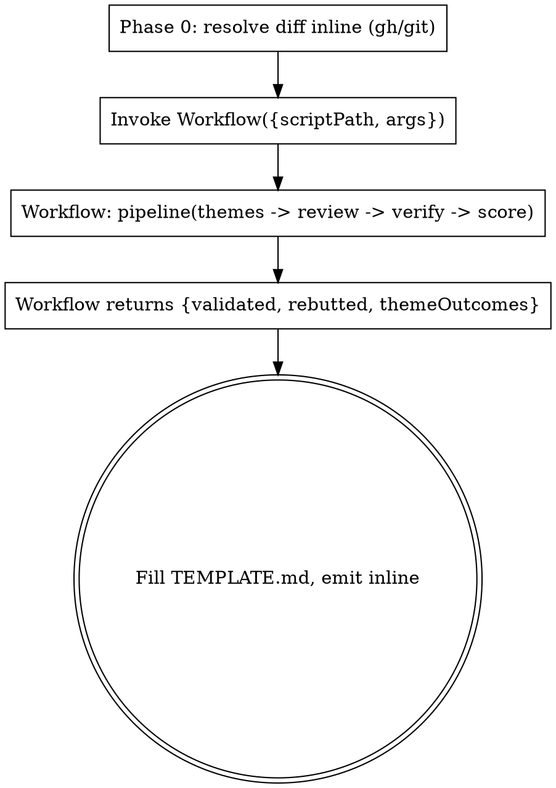

# Greatreview

A workflow-orchestrated two-phase audit: fan out theme specialists, then adversarially verify every finding. The fan-out, finding-counting, and verdict-bucketing run inside a **static bundled JavaScript workflow** (`greatreview.workflow.js`) executed by the `Workflow` tool. The script holds the loop; your context only sees the final structured result.

**Read-only audit.** Produces a weakness map (what's weak, why, what breaks, suggested fix). Never modifies code, runs tests, commits, or opens PRs. Renders with this skill's `TEMPLATE.md`; see this skill's `SAMPLE.md` (a worked PR review) as the quality anchor for a fully-filled report.

## When to use

Use `greatreview` when the user wants a validated code review run as one resumable background workflow that returns structured data, and opts into workflow orchestration ("ultracode", "workflow", "run a workflow"). Calling the `Workflow` tool from this skill satisfies the explicit-opt-in requirement. Read-only: it documents weaknesses, it does not fix them.

**Do NOT use** for: a quick single read; fixing code (read-only); trivial one-line diffs; planning work (feed this skill's output into planning instead).

## How it runs



The workflow script **cannot run shell or read git** — agents do that, the script only coordinates. So Phase 0 (diff resolution) runs in your main context BEFORE the workflow, and you pass the diff path + file list in via `args`.

### Step 0 — Phase 0: resolve the source (you, inline)

Seed pass:

1. **Resolve source** to a unified diff on disk:
   - PR number: `gh pr view N --json title,body,author,additions,deletions,changedFiles,baseRefName,headRefName,url`, then `gh pr diff N > /tmp/claude/<id>.diff`.
   - Branch: `git diff <base>...<branch> > /tmp/claude/<id>.diff` (base usually `main`/`master`).
   - Staged: `git diff --cached > /tmp/claude/<id>.diff`.
   - Raw diff path: use it directly.
2. **gh TLS sandbox workaround**: if `gh` fails with `tls: failed to verify certificate: x509: OSStatus -26276`, retry that command with `dangerouslyDisableSandbox: true`.
3. **Retain Phase 0 metadata for the report** — the workflow does NOT return any of it. Keep the `gh pr view --json` fields (title, author, additions, deletions, changedFiles) and `git diff --stat`. You fill the report's **Scope**, **Phase 0 — Overview**, and per-file **Files touched (+N −M)** from this.
4. **Extract residual risk now** — scan the PR body and commit messages for items the author explicitly flagged as deferred / out-of-scope. These feed the report's **Residual risk** section; the workflow never surfaces them.
5. **Collect** absolute paths of changed files (`git diff --name-only …`) and the relevant project rule docs (CLAUDE.md, `.ai/RULES.md`, constitutions). For a large/non-trivial diff, also capture full-context lines (`git diff -U20`) and pass the extra files so theme agents see surrounding code, not just compacted hunks.
6. **Announce**: "Reviewing <id>: <title>. Launching greatreview workflow."

All reviewer agent types are fixed to the bundled `*` agents (conventions included). Convey the stack via the `stack` arg and pass the project's rule docs in `projectDocs` — that is how the conventions review learns this project's idioms.

### Step 1 — Invoke the workflow

Call the `Workflow` tool with `scriptPath` pointing at `greatreview.workflow.js` **in this skill's directory** (absolute path) and `args`:

```
Workflow({
  scriptPath: "<this skill dir>/greatreview.workflow.js",
  args: {
    sourceId: "PR 267",
    repo: "Digitaleo/php.social-ads",
    stack: "PHP/Laravel",
    diffPath: "/tmp/claude/267.diff",
    modifiedFiles: ["/abs/path/A.php", "/abs/path/B.php"],
    projectDocs: ["/abs/CLAUDE.md", "/abs/.ai/RULES.md"],
    themes: ["correctness","security","architecture","testing","conventions","deadcode-perf"]  // omit for all 6; pass a subset for narrow scope
  }
})
```

`themes` is optional — omit to run all six, or pass a subset when the user asks for "only security + architecture".

The workflow runs Phase 1 (one specialist per theme, `agent()` with a findings schema, ≤5 findings each, empty allowed) and Phase 2 (one skeptic `agent()` per finding, verdict schema CONFIRMED/EXAGGERATED/INVALID) as a no-barrier `pipeline` — verification of one theme overlaps review of the next. It is resumable within the session.

A third stage, **Phase 2.5 (Score)**, runs inside the same per-finding block: every finding whose skeptic verdict is `CONFIRMED` or `EXAGGERATED` is scored by one cheap `scorer` agent (haiku) on `Impact × Opportunity` (each 1–5, product 1–25). The product and its band (`fix-now` ≥15 · `normal` 6–14 · `defer` ≤5) are computed in JS, with a **severity floor**: any Critical/High finding is `fix-now` regardless of score. A finding whose scorer died is `unscored` (sorted as normal, never auto-deferred). INVALID/UNVALIDATED findings are not scored.

### Step 2 — Phase 3: render the report (you)

The workflow returns structured data — no parsing of prose needed:

```
{ source, validated[], rebutted[], themeOutcomes[], counts: {raw, validated, rebutted, agents, bands} }
```

- `validated[]` — INVALID-dropped, severity already adjusted (EXAGGERATED lowered; CONFIRMED echoes the original), sorted band → severity → score. Each has **id** (stable `F<n>` for downstream handoff), theme, severity, location, claim, evidence, why, impact, fix, **verdict**, validatorNote. Plus the scorer fields: `impactScore` (1–5), `opportunityScore` (1–5), `score` (product, or null), `band` (`fix-now`/`normal`/`defer`/`unscored`), `impactWhy`, `opportunityWhy`. `counts.bands` holds the `{band: count}` tally.
- `rebutted[]` — INVALID and UNVALIDATED findings, with the skeptic's reason. **Load-bearing transparency section** — render every entry.
- `themeOutcomes[]` — `{theme, raw, validated, failed}` per theme for the outcomes table.
- **Band-group the report**: render validated findings under band headings (`fix-now`, `normal`, `defer`, `unscored`) per `TEMPLATE.md`, and put the band tally from `counts.bands` in the verdict line (e.g. "2 fix-now / 3 normal / 1 defer"). The severity floor means a Critical is always `fix-now` — never present a Critical/High under `defer`.

Fill this skill's `TEMPLATE.md`, derive the verdict line, and **emit the full Markdown report inline in chat** (do not auto-write to disk — the user copies it where needed):

- **Verdict**: any Critical validated → `Block — Critical issues`; else any validated → `Request changes (N findings)`; else `Approve & merge`.
- **Phase 0 fields come from Step 0, not the workflow**: fill **Scope** (`+additions/−deletions`, file count), **Phase 0 — Overview** (what the PR does), and per-file **Files touched (+N −M)** from the retained `gh pr view`/`--stat` data. Fill **Residual risk** from the deferred items extracted in Step 0.4 (omit the section only if there were genuinely none).
- **Themes audited line**: list the themes actually run, derived from `themeOutcomes[].theme` — do NOT hard-code all six (a subset run must not claim full coverage).
- **Finding cards**: render each `evidence` inside a fenced code block (it may contain newlines or a verbatim excerpt).
- **Rebutted section — render BOTH kinds**: every `rebutted[]` entry (INVALID / UNVALIDATED), AND every `validated[]` entry whose `verdict === 'EXAGGERATED'` as `"EXAGGERATED → downgraded to <severity> (kept above)"` using its `validatorNote`. Skipping the EXAGGERATED case hides that validation did real work.
- **Theme outcomes table**: one row per `themeOutcomes` entry; if `failed` is true, mark the row `agent failed` — that is NOT a clean theme.
- Close with `Total agents spawned: counts.agents`.

## Failure modes & guardrails

- **A review agent dies**: `agent()` returns null → `themeOutcomes` marks that theme `failed: true` (distinct from a clean 0-findings theme). Render the row as `agent failed`; do not fabricate.
- **A skeptic returns no verdict** (after the workflow's one retry): the finding lands in `rebutted` as `UNVALIDATED` — surface it in an "Unvalidated (manual review needed)" note, never promote it as validated.
- **No validated findings**: legitimate. Report `Approve & merge — 0 validated weaknesses` with the per-theme breakdown. Do not dig for nits.
- **`Workflow` tool unavailable** (older Claude Code, no opt-in): run the same two-phase audit by hand — dispatch the theme specialists and skeptic validators as ordinary agents instead of via the bundled workflow.

## Cost

Clean diff ≈ 6 review agents. Noisy diff ≈ 6 + N skeptics (one per raw finding) + V haiku scorers (one per *validated* finding, V ≤ N). Haiku scorers are the cheapest class and only run on skeptic-survivors. Caps: 16 concurrent agents, 1000 per run. Narrow scope by passing a `themes` subset.
